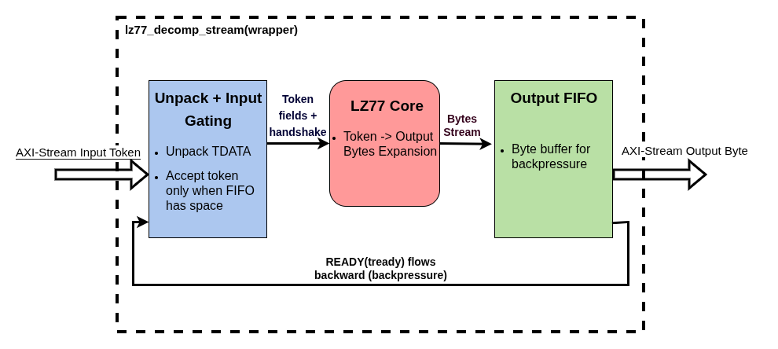
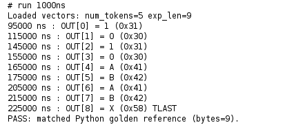
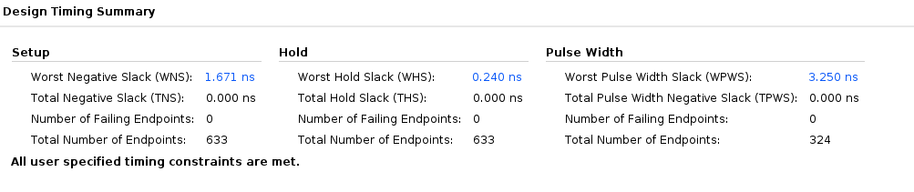
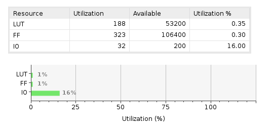
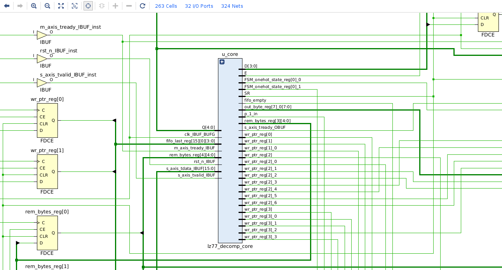

# LZ77 Decompressor (SystemVerilog) + AXI-Stream Wrapper

A small LZ77 decompressor written in SystemVerilog.
This repo includes:
- a decompression **core** (token-in, byte-out)
- an **AXI-Stream wrapper** that adds backpressure handling using a small FIFO
- a **Python golden model + vector generator**
- a self-checking simulation flow in Vivado

---

## What is LZ77 Algorithm?

LZ77 is a lossless compression idea based on reuse.
Instead of writing repeated data again, it writes a reference to bytes that already appeared recently.

A token usually contains:
- **distance**: how far back to look
- **length**: how many bytes to copy
- **literal**: the next byte after the match

Decompression does:
1) copy `length` bytes from `distance` bytes back (history window)
2) output the final `literal` byte

---

## What this repo implements

### 1) `lz77_decomp_core.sv` (the decompressor core)
The core accepts token fields using a simple handshake:
- `in_valid / in_ready`
- `in_distance, in_length, in_literal`

It outputs decompressed bytes:
- `out_valid`
- `out_byte`

Internally it uses a circular history buffer and an FSM:
- if `length == 0` → output only the literal
- if `length > 0` → output copied bytes (one per cycle), then output the literal

Important point: the core has **no output ready**, so it cannot pause if downstream is slow.

---

### 2) `lz77_decomp_stream.sv` (AXI-Stream wrapper + FIFO)
The wrapper converts the core into a streaming block with:
- **AXI-Stream input** for tokens (`s_axis_*`)
- **AXI-Stream output** for bytes (`m_axis_*`)

#### What backpressure means here
Backpressure means the downstream block can say:
“I’m not ready to take data right now.”
In AXI-Stream this is done by deasserting `m_axis_tready`.

If the producer can’t stop and you don’t buffer, you lose data.  
So the wrapper adds a FIFO to absorb output bytes safely.

#### How this wrapper handles backpressure
- The core writes output bytes into an **output FIFO**
- The AXI output reads bytes from FIFO using `m_axis_tready`
- The wrapper controls `s_axis_tready` so it **only accepts a token when it is safe**

Token output size:
- if `len=0` → 1 byte
- else → `len+1` bytes (copied bytes + final literal)

So before accepting a token, the wrapper checks:
- FIFO has enough free space for the token’s worst-case output

#### TLAST behavior
- `s_axis_tlast` marks the last **input token**
- `m_axis_tlast` is asserted on the last **output byte** produced by that last token

---

## Block diagram (high-level)

This is the top-level dataflow of `lz77_decomp_stream` (wrapper).  
Data moves left → right. `READY/tready` flows backward (backpressure).

**Blocks**
- **Unpack + Input Gating**: unpacks input `TDATA` into `{distance, length, literal}` and only accepts a token when it is safe (enough FIFO space for that token’s worst-case output).
- **LZ77 Core**: expands each token into output bytes (copy `length` bytes from history, then output the final `literal`).
- **Output FIFO**: buffers output bytes so the stream can handle downstream stalls (`m_axis_tready` low) without losing data.

---

## Token format
The AXI input token is packed into `TDATA` as:

`{distance, length, literal}`

Where:
- literal is always `[7:0]`
- `distance` is `DIST_WIDTH` bits
- `length` is `LEN_WIDTH` bits
- total width: `TOKEN_W = DIST_WIDTH + LEN_WIDTH + 8`

---

## Python golden model + test vectors
This repo uses a Python script to do two jobs:
1) act as a **golden reference** (software model of the same token rules)
2) generate test vectors as `.mem` files used by the Vivado testbench

The script produces:
- `tokens.mem`   (packed tokens, hex per line)
- `expected.mem` (expected output bytes, hex per line)
- `meta.mem`     (NUM_TOKENS and EXP_LEN, 32-bit hex)

---

## Build configuration used for the shared results
- `DIST_WIDTH = 4`
- `LEN_WIDTH  = 4`
- `TOKEN_W    = 16`
- Constraint: **150 MHz** (`constraints/lz77_decomp_const.xdc`)

---

## Results (Xilinx Vivado 2024.2)

### Functional simulation (self-checking)
This run uses the `.mem` vectors generated by the Python script and compares the RTL output stream against the expected bytes.

The waveform shows tokens entering on `s_axis_*` and the decompressed bytes leaving on `m_axis_*`.  
`meta.mem` drives `NUM_TOKENS` and `EXP_LEN`, and the testbench asserts PASS once all expected bytes match.

---

### Timing (150 MHz constraint)
Implemented design timing summary with the 150 MHz clock constraint.

---

### Resource utilization
Device utilization for the implemented design on Xilinx Zynq 7000 ZC702 FPGA Board.

---

### Netlist schematic (core zoom)
A zoomed-in schematic view around the `lz77_decomp_core` instance to show how the wrapper connects into the core.

---

## Assumptions of the design
- The wrapper handles **output backpressure** using a FIFO, but it does not guarantee “infinite buffering”.
  If a consumer stalls long enough and the FIFO fills up, the wrapper applies backpressure upstream
  by deasserting `s_axis_tready` (so the source must stop sending tokens).
  
- This is a clean streaming block, not a full decompression standard (no headers, checksums, error recovery).

